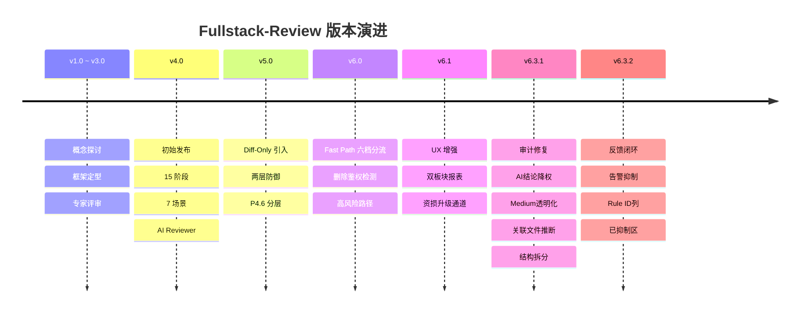

# Fullstack-Review 版本演进可视化

## 版本迭代时间轴



## 五维能力雷达评分

```mermaid
---
config:
  theme: base
  themeVariables:
    fontSize: 14px
---
xychart-beta
    title "版本能力评分对比（满分10）"
    x-axis ["架构完整度", "扫描性能", "安全覆盖", "体验检测", "开发体验"]
    y-axis "评分" 0 --> 10
    bar [8, 3, 8, 2, 4]
    bar [8, 5, 8, 2, 6]
    bar [9, 9, 9, 2, 9]
    bar [10, 9, 9, 8, 10]
    bar [10, 9, 10, 9, 10]
```



## 版本评分矩阵

| 维度 | v4.0 | v5.0 | v6.0 | v6.1 | v6.3.1 | v6.3.2 | 说明 |
|------|:---:|:---:|:---:|:---:|:---:|:---:|------|
| 架构完整度 | 8 | 8 | 9 | **10** | **10** | **10** | v6.3.1 结构拆分 · v6.3.2 反馈闭环 |
| 扫描性能 | 3 | 5 | 9 | **9** | **9** | **9** | Fast Path 六档分流不变 |
| 安全覆盖 | 8 | 8 | 9 | **9** | **10** | **10** | v6.3.1 AI降权 · v6.3.2 抑制防磨损 |
| 体验检测 | 2 | 2 | 2 | **8** | **9** | **9** | v6.3.1 透明化 · v6.3.2 框架提示 |
| 开发体验 | 4 | 6 | 9 | **10** | **10** | **10** | v6.3.1 按需加载 · v6.3.2 抑制+Rule ID |

## 版本总评

```mermaid
graph LR
    subgraph v4.0
        A1[架构完整] --> A2[全库扫描]
        A2 --> A3[速度慢]
    end
    subgraph v5.0
        B1[Diff-Only] --> B2[只审diff]
        B2 --> B3[范围精准]
    end
    subgraph v6.0
        C1[Fast Path] --> C2[六档分流]
        C2 --> C3[快慢自适应]
    end
    subgraph v6.1
        D1[UX增强] --> D2[双维度落地]
        D2 --> D3[资损可阻断]
    end
    subgraph v6.3.2
        E1[反馈闭环] --> E2[告警抑制]
        E2 --> E3[Rule ID + 已抑制区]
    end
    A3 -->|v5| B1
    B3 -->|v6| C1
    C3 -->|v6.1| D1
    D3 -->|v6.3.2| E1
```



## 一句话

```
v4.0  补齐审查能力         ═══════════════════════  架构从无到有
v5.0  限定审查范围         ══════════════            只审diff不扫全库
v6.0  优化审查速度         ═══════════════════════  改CSS秒出改支付全量
v6.1  拉满审查深度         ═══════════════════════  技术和体验都堵上
v6.3.1 夯实可信基础         ═══════════════════════  AI不可信标注+推断透明化+结构拆分
v6.3.2 闭环反馈             ═══════════════════════  告警抑制+Rule ID+不再重复误报
```
